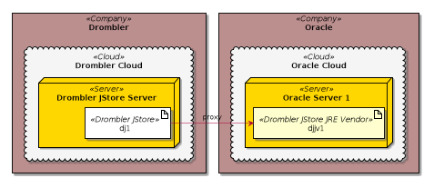
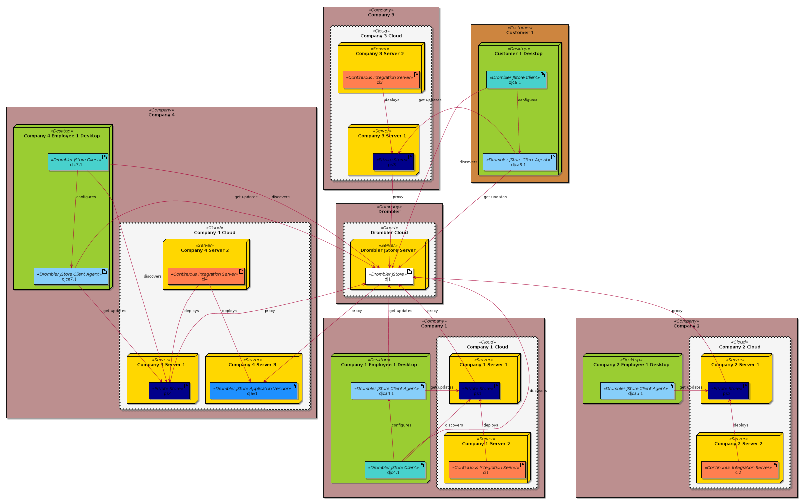

Under Construction

## Managed Native Components Scenarios

## End-User Scenarios

### End-User Scenario 1
"End-user 1" shows the simplest scenario: 

On the desktop computer _Drombler JStore Client Agent_ and _Drombler JStore Client_
is installed. The agent gets updates from the JStore backend run by Drombler.
The Java-based rich client can discover new applications and configure the agent.

### End-User Scenario 2
"End-user 2" shows another scenario:

In addition to the desktop computer with a _Drombler JStore Client Agent_ and 
a _Drombler JStore Client_ installation "End-user 2" also has a headless NAS 
and a headless IoT device. Both devices also have a _Drombler JStore Client Agent_
which can get updates from the JStore backend.

The _Drombler JStore Client_ on the desktop computer not only manages the agent
on desktop computer but also the agents on the two other devices.

### End-User Scenario 3
"End-user 3" shows another scenario:

"End-user 3" has two desktop computer with Drombler JStore Client / Client Agent installed.

The JStore backend could be enhanced to support user profiles which would allow
"End-user 3" to synchronize the set of JStore applications installed.

E.g. if a new application is installed on the desktop 1, the same application would
also be installed on the desktop 2, if synchronization is active.

## Enterprise Scenarios

### Enterprise Scenario 1
"Company 1" shows an enterprise scenario:

"Company 1" runs a private version of a JStore-like backend which hosts
the internal business applications and could optionally also provide a proxy to the
JStore backend run by Drombler, possibly also filtering some applications or
run some additional security checks.

### Enterprise Scenario 2
"Company 2" shows an enterprise scenario:

### Enterprise Scenario 3
"Company 3" and "Customer 1" show another enterprise scenario:

### Enterprise Scenario 4
"Company 4" shows an enterprise scenario: